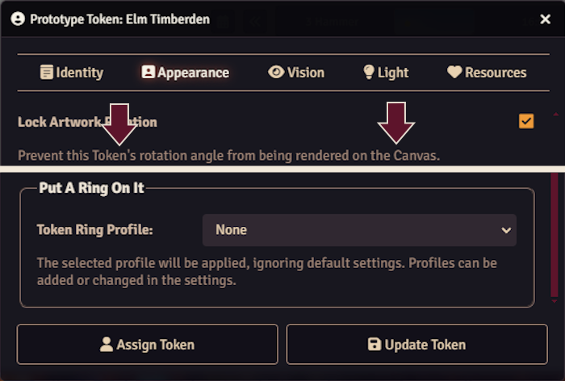
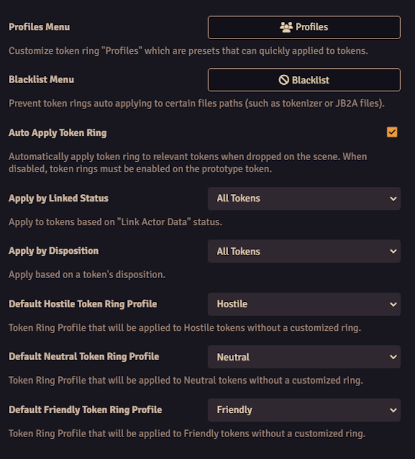

# Put A Ring On It

Automatically create customizable token rings for tokens placed on scenes. Create different profiles for friendly, neutral, and hostile tokens, or create custom profiles and apply them to individual tokens. Easy to disable, token rings are applied via PIXI and no files are created or edited. Ready-to-go with default profiles, no setup required. Compatible with Tokenizer, system tokens, and JB2A tokens, will not apply token rings to them by default. Requires libWrapper only.

Customize token rings with "profiles" created in the settings. Change the texture, width, color, shadows, glows, and outlines all within the editor.

Use your own textures or even your own premade token rings. Create extra profiles for individual actors.

Select a token ring profile to be applied regardless of the settings. This can overrite default rings, or will apply the ring when auto apply is disabled.

Settings allow you to customize and create profiles, set the blacklist to prevent default token rings from applying, and control the automatic application of token rings by linked status and disposition.

## Support me

If you enjoy the module and are in the position to, please consider supporting me on Ko-fi.
